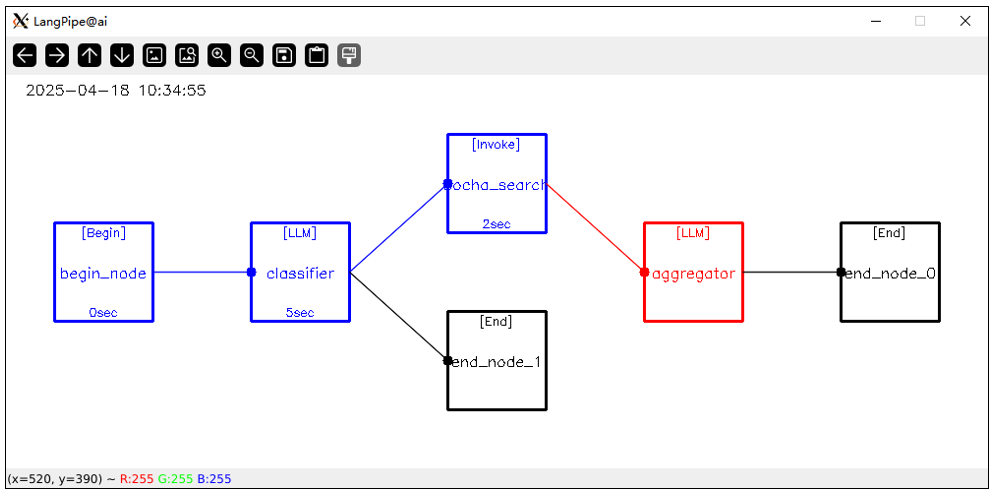

# PyLangPipe

<p style="" align="center">
  
</p>
a simple lightweight large language model pipeline framework. which is easy to use and extend for several tasks.
- text generation  
- chat  with LLM
- task classification
- parameters extraction
- RAG based on Web Search (online)
- RAG based on SQL (database)
- RAG based on Vector (knowledge base)

## prepare environment

> tested on Ubuntu 18.04/20.04/22.04 with 4*RTX 4080 GPUs.

1. install Ollama from https://ollama.ai/download
```
# pull LLMs used by test scripts in tests/
ollama pull minicpm-v:8b  # support text & image input
ollama pull qwen2.5:7b    # support text only
other LLMs you want to use...
```

2. install pylangpipe
```
git clone https://github.com/sherlockchou86/PyLangPipe.git
cd PyLangPipe
conda create -n pylangpipe python=3.12
conda activate pylangpipe
pip install -r requirements.txt

python setup.py sdist bdist_wheel
pip install .
```

## run tests
```
cd ./tests
python 00-chat_test.py
python 01-text_generation_test.py
python 02-task_classification_test.py
python 03-parameters_extraction_test.py
python 04-notice_generation_test.py
python 05-pipeline_render_test.py
python 10-search_engine_rag.py
python 11-sql_rag.py
python 12-vector_rag.py
...
```
[more samples](./tests/) in `./tests/`

## quick start
```python
import langpipe
import sample_nodes

query = """
腾讯今日的股价行情?
"""
query2 = """
写一篇有关暴力的校园短篇小说。
"""
query3 = """
小米汽车高速撞车重大事故的详细经过是怎样的？该事件对小米影响如何
"""
query4 = """
如何治疗反流性食管炎
"""
query5 = """
周杰伦是谁，在华语乐坛有什么成就？
"""

labels_desc = {
    '正常问题': '非敏感问题，都归属于正常问题',
    '敏感问题': '一切涉及政治、色情、歧视、暴恐等违法内容的问题'
}

# create nodes
begin = langpipe.LPBegin('begin_node')
classifier = langpipe.LPClassifier('classifier', labels_desc)
bocha_search = sample_nodes.LPBoChaSearch('bocha_search', 'sk-***') # replace with your own api key
aggregator = langpipe.LPSuperAggregator('aggregator', None, True, 'qwen2.5:7b')  # including reference sources
end0 = langpipe.LPEnd('end_node_0')  # 正常问题 结束分支
end1 = langpipe.LPEnd('end_node_1')  # 敏感问题 结束分支

# link together
begin.link(classifier)
classifier.link([bocha_search, end1]) # split into 2 branches automatically
bocha_search.link(aggregator)
aggregator.link([end0])

# input what you want to
begin.input(query5, None, False)

# visualize the pipeline with data flow
print('-----board for debug purpose-----')
renderer = langpipe.LPBoardRender(node_size=100)
renderer.render(begin)
```

**pipeline on GUI**:


**output to browser**:


**output from console**:
```json
>>>>>>>>>>>>>[output][final_out from end_node_0]>>>>>>>>>>>>>
{
    "content": "周杰伦，1979年1月18日出生于中国台湾省新北市，祖籍福建省永春县。他是一位华语流行乐男歌手、音乐人、演员、导演和编剧。自出道以来，周杰伦凭借其独特的音乐风格和才华横溢的创作能力，在华语乐坛取得了显著成就。\n\n2000年发行首张个人专辑《Jay》，该专辑融合了R&B、Hip-Hop等多种音乐风格，并且其中主打歌曲《星晴》获得了第24届十大中文金曲优秀国语歌曲金奖。这张专辑不仅让周杰伦一战成名，还带动了华语R&B、嘻哈和中国风的流行<a href=\"https://baike.baidu.com/item/%E5%91%A8%E6%9D%B0%E4%BC%A6/129156\" target=\"_blank\">[1]</a>。\n\n2001年发行的专辑《范特西》奠定了他融合中西方音乐的风格，并且凭借该专辑获得了第15届台湾金曲奖最佳流行音乐演唱专辑奖。同年，周杰伦还成为美国《时代》杂志封面人物<a href=\"https://vebaike.com/doc-view-1270.html\" target=\"_blank\">[2]</a><a href=\"http://1zhr9wp4.shshilin.com/mobile/news/show-323436.html\" target=\"_blank\">[3]</a>。\n\n2004年发行的专辑《七里香》在全亚洲首月销量达300万张，并且获得了世界音乐大奖中国区最畅销艺人奖<a href=\"https://baike.baidu.com/item/%E5%91%A8%E6%9D%B0%E4%BC%A6/129156\" target=\"_blank\">[1]</a>。此外，他还主演了个人首部电影《头文字D》，凭借该片获得了第25届香港电影金像奖和第42届台湾电影金马奖的最佳新演员奖<a href=\"https://vebaike.com/doc-view-1270.html\" target=\"_blank\">[2]</a><a href=\"http://1zhr9wp4.shshilin.com/mobile/news/show-323436.html\" target=\"_blank\">[3]</a>。\n\n从2006年起连续三年获得世界音乐大奖中国区最畅销艺人奖。2017年，周杰伦监制的爱情冒险电影《一万公里的约定》上映，并担任明星经理人的综艺节目《这！就是灌篮》的导师<a href=\"https://piaofang.maoyan.com/celebrity?id=28427\" target=\"_blank\">[4]</a><a href=\"https://baijiahao.baidu.com/s?id=1820484479709473213\" target=\"_blank\">[5]</a>。\n\n周杰伦不仅在音乐上取得了巨大成功，在商业和设计领域也有涉足。他于2007年成立了杰威尔有限公司，同年还担任了华硕笔电设计师，并入股香港文化传信集团<a href=\"https://music.apple.com/cn/playlist/%E5%91%A8%E6%9D%B0%E4%BC%A6%E5%86%99%E7%9A%84%E6%AD%8C/pl.5a3e20295f804b298e507226f335e567\" target=\"_blank\">[6]</a>。\n\n此外，周杰伦热心公益慈善事业，多次向中国内地灾区捐款捐物，如在2008年捐款援建希望小学。他还曾担任中国禁毒宣传形象大使<a href=\"https://baijiahao.baidu.com/s?id=1820484479709473213\" target=\"_blank\">[5]</a><a href=\"https://www.mingrenw.cn/ziliao/3/2970.html\" target=\"_blank\">[7]</a>。\n\n综上所述，周杰伦是华语乐坛独一无二的存在，他的音乐陪伴了许多人的青春，并且他凭借多方面的才华和成就，在全球范围内都享有极高的声誉<a href=\"https://baike.baidu.com/item/%E5%91%A8%E6%9D%B0%E4%BC%A6/129156\" target=\"_blank\">[1]</a><a href=\"https://vebaike.com/doc-view-1270.html\" target=\"_blank\">[2]</a><a href=\"http://1zhr9wp4.shshilin.com/mobile/news/show-323436.html\" target=\"_blank\">[3]</a><a href=\"https://piaofang.maoyan.com/celebrity?id=28427\" target=\"_blank\">[4]</a><a href=\"https://baijiahao.baidu.com/s?id=1820484479709473213\" target=\"_blank\">[5]</a><a href=\"https://music.apple.com/cn/playlist/%E5%91%A8%E6%9D%B0%E4%BC%A6%E5%86%99%E7%9A%84%E6%AD%8C/pl.5a3e20295f804b298e507226f335e567\" target=\"_blank\">[6]</a><a href=\"https://www.mingrenw.cn/ziliao/3/2970.html\" target=\"_blank\">[7]</a>。",
    "references": [
        "https://baike.baidu.com/item/%E5%91%A8%E6%9D%B0%E4%BC%A6/129156",
        "https://vebaike.com/doc-view-1270.html",
        "http://1zhr9wp4.shshilin.com/mobile/news/show-323436.html",
        "https://piaofang.maoyan.com/celebrity?id=28427",
        "https://baijiahao.baidu.com/s?id=1820484479709473213",
        "https://music.apple.com/cn/playlist/%E5%91%A8%E6%9D%B0%E4%BC%A6%E5%86%99%E7%9A%84%E6%AD%8C/pl.5a3e20295f804b298e507226f335e567",
        "https://www.mingrenw.cn/ziliao/3/2970.html"
    ]
}
<<<<<<<<<<<<<[output][final_out from end_node_0]<<<<<<<<<<<<<
>>>>>>>>>>>>>[debug][lpdata from end_node_0]>>>>>>>>>>>>>
{
    "sync": false,
    "begin_t": "2025-04-15 10:44:30",
    "end_t": "2025-04-15 10:44:52",
    "query": "\n周杰伦是谁，在华语乐坛有什么成就？\n",
    "query_imgs": null,
    "final_out": "{\n    \"content\": \"周杰伦，1979年1月18日出生于中国台湾省新北市，祖籍福建省永春县。他是一位华语流行乐男歌手、音乐人、演员、导演和编剧。自出道以来，周杰伦凭借其独特的音乐风格和才华横溢的创作能力，在华语乐坛取得了显著成就。\\n\\n2000年发行首张个人专辑《Jay》，该专辑融合了R&B、Hip-Hop等多种音乐风格，并且其中主打歌曲《星晴》获得了第24届十大中文金曲优秀国语歌曲金奖。这张专辑不仅让周杰伦一战成名，还带动了华语R&B、嘻哈和中国风的流行<a href=\\\"https://baike.baidu.com/item/%E5%91%A8%E6%9D%B0%E4%BC%A6/129156\\\" target=\\\"_blank\\\">[1]</a>。\\n\\n2001年发行的专辑《范特西》奠定了他融合中西方音乐的风格，并且凭借该专辑获得了第15届台湾金曲奖最佳流行音乐演唱专辑奖。同年，周杰伦还成为美国《时代》杂志封面人物<a href=\\\"https://vebaike.com/doc-view-1270.html\\\" target=\\\"_blank\\\">[2]</a><a href=\\\"http://1zhr9wp4.shshilin.com/mobile/news/show-323436.html\\\" target=\\\"_blank\\\">[3]</a>。\\n\\n2004年发行的专辑《七里香》在全亚洲首月销量达300万张，并且获得了世界音乐大奖中国区最畅销艺人奖<a href=\\\"https://baike.baidu.com/item/%E5%91%A8%E6%9D%B0%E4%BC%A6/129156\\\" target=\\\"_blank\\\">[1]</a>。此外，他还主演了个人首部电影《头文字D》，凭借该片获得了第25届香港电影金像奖和第42届台湾电影金马奖的最佳新演员奖<a href=\\\"https://vebaike.com/doc-view-1270.html\\\" target=\\\"_blank\\\">[2]</a><a href=\\\"http://1zhr9wp4.shshilin.com/mobile/news/show-323436.html\\\" target=\\\"_blank\\\">[3]</a>。\\n\\n从2006年起连续三年获得世界音乐大奖中国区最畅销艺人奖。2017年，周杰伦监制的爱情冒险电影《一万公里的约定》上映，并担任明星经理人的综艺节目《这！就是灌篮》的导师<a href=\\\"https://piaofang.maoyan.com/celebrity?id=28427\\\" target=\\\"_blank\\\">[4]</a><a href=\\\"https://baijiahao.baidu.com/s?id=1820484479709473213\\\" target=\\\"_blank\\\">[5]</a>。\\n\\n周杰伦不仅在音乐上取得了巨大成功，在商业和设计领域也有涉足。他于2007年成立了杰威尔有限公司，同年还担任了华硕笔电设计师，并入股香港文化传信集团<a href=\\\"https://music.apple.com/cn/playlist/%E5%91%A8%E6%9D%B0%E4%BC%A6%E5%86%99%E7%9A%84%E6%AD%8C/pl.5a3e20295f804b298e507226f335e567\\\" target=\\\"_blank\\\">[6]</a>。\\n\\n此外，周杰伦热心公益慈善事业，多次向中国内地灾区捐款捐物，如在2008年捐款援建希望小学。他还曾担任中国禁毒宣传形象大使<a href=\\\"https://baijiahao.baidu.com/s?id=1820484479709473213\\\" target=\\\"_blank\\\">[5]</a><a href=\\\"https://www.mingrenw.cn/ziliao/3/2970.html\\\" target=\\\"_blank\\\">[7]</a>。\\n\\n综上所述，周杰伦是华语乐坛独一无二的存在，他的音乐陪伴了许多人的青春，并且他凭借多方面的才华和成就，在全球范围内都享有极高的声誉<a href=\\\"https://baike.baidu.com/item/%E5%91%A8%E6%9D%B0%E4%BC%A6/129156\\\" target=\\\"_blank\\\">[1]</a><a href=\\\"https://vebaike.com/doc-view-1270.html\\\" target=\\\"_blank\\\">[2]</a><a href=\\\"http://1zhr9wp4.shshilin.com/mobile/news/show-323436.html\\\" target=\\\"_blank\\\">[3]</a><a href=\\\"https://piaofang.maoyan.com/celebrity?id=28427\\\" target=\\\"_blank\\\">[4]</a><a href=\\\"https://baijiahao.baidu.com/s?id=1820484479709473213\\\" target=\\\"_blank\\\">[5]</a><a href=\\\"https://music.apple.com/cn/playlist/%E5%91%A8%E6%9D%B0%E4%BC%A6%E5%86%99%E7%9A%84%E6%AD%8C/pl.5a3e20295f804b298e507226f335e567\\\" target=\\\"_blank\\\">[6]</a><a href=\\\"https://www.mingrenw.cn/ziliao/3/2970.html\\\" target=\\\"_blank\\\">[7]</a>。\",\n    \"references\": [\n        \"https://baike.baidu.com/item/%E5%91%A8%E6%9D%B0%E4%BC%A6/129156\",\n        \"https://vebaike.com/doc-view-1270.html\",\n        \"http://1zhr9wp4.shshilin.com/mobile/news/show-323436.html\",\n        \"https://piaofang.maoyan.com/celebrity?id=28427\",\n        \"https://baijiahao.baidu.com/s?id=1820484479709473213\",\n        \"https://music.apple.com/cn/playlist/%E5%91%A8%E6%9D%B0%E4%BC%A6%E5%86%99%E7%9A%84%E6%AD%8C/pl.5a3e20295f804b298e507226f335e567\",\n        \"https://www.mingrenw.cn/ziliao/3/2970.html\"\n    ]\n}",
    "global_vars": {
        "cls_label": "正常问题",
        "searched_result": "[[引用: 1]]\n标题: 周杰伦（华语流行乐男歌手、音乐人、演员、导演、编剧）\nURL: https://baike.baidu.com/item/%E5%91%A8%E6%9D%B0%E4%BC%A6/129156\n摘要: 华语流行乐男歌手、音乐人、演员、导演、编剧\n目录\n1 早年经历 2 演艺经历 ▪ 出道成名 ▪ 持续进步 ▪ 自立门户 ▪ 曲风探索 ▪ 稳步发展\n3 个人生活 4 主要作品 ▪ 音乐专辑 ▪ 音乐单曲 ▪ 为他人创作 ▪ 演唱会记录 ▪ 参演电影\n▪ 参演电视剧 ▪ 综艺节目 ▪ 导演作品 ▪ 编剧作品 ▪ 出版作品 ▪ 监制作品 ▪ 配音作品 5 社会活动\n▪ 公益活动 ▪ 担任大使 ▪ 其它领域 6 获奖记录 7 人物评价\n基本信息\n周杰伦（Jay Chou），1979年1月18日出生于中国台湾省新北市，祖籍福建省永春县，华语流行乐男歌手、音乐人、演员、导演、编剧，毕业于 淡江中学 。\n2000年，发行个人首张音乐专辑《 Jay 》  [26] 。2001年，凭借专辑《 范特西 》奠定其融合中西方音乐的风格  [16] 。2002年，举行“The One”世界巡回演唱会  [1] 。2003年，成为美国《 时代 》杂志封面人物  [2] ；同年，全亚洲发行音乐专辑《 叶惠美 》  [21] ，该专辑获得 第15届台湾金曲奖 最佳流行音乐演唱专辑奖  [23] 。2004年，发行音乐专辑《 七里香 》  [29] ，该专辑在全亚洲的首月销量达300万张  [276] ；同年，获得 世界音乐大奖 中国区最畅销艺人奖  [280] 。2005年，主演个人首部电影《 头文字D 》  [274] ，凭借该片获得 第25届香港电影金像奖 和 第42届台湾电影金马奖 的最佳新演员奖  [3]  [275] ...\n内容详细: 周杰伦（Jay Chou），1979年1月18日出生于中国台湾省新北市，祖籍福建省永春县，华语流行乐男歌手、音乐人、演员、导演、编剧，毕业于淡江中学。2000年，发行个人首张音乐专辑《Jay》。2001年，凭借专辑《范特西》奠定其融合中西方音乐的风格。2002年，举行“The One”世界巡回演唱会。2003年，成为美国《时代》杂志封面人物；同年，全亚洲发行音乐专辑《叶惠美》，该专辑获得第15届台湾金曲奖最佳流行音乐演唱专辑奖。2004年，发行音乐专辑《七里香》，该专辑在全亚洲的首月销量达300万张；同年，获得世界音乐大奖中国区最畅销艺人奖。2005年，主演个人首部电影《头文字D》，凭借该片获得第25届香港电影金像奖和第42届台湾电影金马奖的最佳新演员奖。2006年起，连续三年获得世界音乐大奖中国区最畅销艺人奖。2007年，自编自导爱情电影《不能说的秘密》，同年，成立杰威尔音乐有限公司。\n网站名称: baike.baidu.com\n网站图标: https://th.bochaai.com/favicon?domain_url=https://baike.baidu.com/item/%E5%91%A8%E6%9D%B0%E4%BC%A6/129156\n发布时间: None\n\n[[引用: 2]]\n标题: 周杰伦\nURL: https://vebaike.com/doc-view-1270.html\n摘要: 周杰伦（Jay Chou），1979年1月18日出生于中国台湾，华语男歌手、词曲创作人、演员、MV及电影导演、编剧及制作人。2000年，发行首张个人专辑《Jay》。\n目录\n1 人物简介 2 演艺经历 3 人物评价\n人物简介 编辑本段\n（Jay Chou），1979年1月18日出生于台湾省新北市，华语男歌手、词曲创作人、演员、MV及电影导演、编剧及制作人。\n2000年，发行首张个人专辑《Jay》。2002年，举行“The One”世界巡回演唱会。2004年，登上央视春晚舞台，并演唱歌曲《龙拳》。2005年，凭借动作片《头文字D》获得台湾电影金马奖、香港电影金像奖最佳新人奖。2006年，起连续三年获得世界音乐大奖中国区最畅销艺人奖。2010年，入选美国《Fast Company》评出的“全球百大创意人物”。2011年，凭借专辑《跨时代》再度获得金曲奖最佳国语男歌手奖，并且第4次获得金曲奖最佳国语专辑奖。2016年，参加综艺节目《中国新歌声第二季》担任导师。2017年1月6日，周杰伦监制爱情电影《一万公里的约定》在中国内地上映。2018年7月13日，担任《中国好声音2018》导师。8月25日，担任明星经理人的综艺节目《这！就是灌篮》播出。2019年9月16日23时，周杰伦新歌《说好不哭》正式上线全网发售，截至17日上午10点整，周杰伦全网累计售出573万张数字单曲。\n2017年6月，二胎儿子出生。\n演艺经历 编辑本段\n2000年11月，以专辑《Jay》出道，获得台湾当年最佳流行音乐演唱专辑、最佳制作人和最...\n内容详细: 该专辑融合了R&B、hip-hop等多种音乐风格，其中主打歌曲《星晴》获得第24届十大中文金曲优秀国语歌曲金奖，而周杰伦也凭借该专辑在华语乐坛受到关注，并于次年获得第12届台湾金曲奖最佳流行音乐演唱专辑奖、第12届台湾金曲奖最佳制作...\n网站名称: vebaike.com\n网站图标: https://th.bochaai.com/favicon?domain_url=https://vebaike.com/doc-view-1270.html\n发布时间: 2023-05-25T00:00:00Z\n\n[[引用: 3]]\n标题: 周杰伦是华语乐坛独一无二的存在。\nURL: https://m.toutiao.com/w/1825077670277323/\n摘要: 周杰伦是华语乐坛独一无二的存在。\n他的音乐融合中西元素，像《范特西》中的《双截棍》，既有中国武术文化，又有西方流行乐的节奏。出道至今发布15张专辑，销量超3000万张，入围金曲奖51次，拿了15座奖杯，这数字相当惊人。\n他的成名路也很励志。从小接触钢琴等多种乐器，虽学业不顺，但没放弃音乐梦。从幕后为他人写歌开始，不断积累经验，即便作品最初未被广泛认可，也没动摇他的决心。他的音乐陪伴了很多人的青春，每一首歌都像是一个故事，承载着无数人的回忆。 #时代偶像周杰伦# #乐坛那些事儿# #最棒的杰伦# #周杰伦唱歌功力#\n内容详细: 他的音乐陪伴了很多人的青春，每一首歌都像是一个故事，承载着无数人的回忆。#时代偶像周杰伦##乐坛那些事儿##最棒的杰伦##周杰伦唱歌功力#...\n网站名称: 今日头条\n网站图标: https://th.bochaai.com/favicon?domain_url=https://m.toutiao.com/w/1825077670277323/\n发布时间: 2025-02-26T08:28:00Z\n\n[[引用: 4]]\n标题: 周杰伦 简介(出道多年获奖无数，他的实力到底有多强？)\nURL: http://1zhr9wp4.shshilin.com/mobile/news/show-323436.html\n摘要: 内容摘要 最近，霸占无数80后90后的青春和童年回忆的那个男人——周杰伦，终于发了新专辑《最伟大的作品》。 专辑一上线，立刻激起了整个互联网的狂欢。《最伟大的作品》刚刚上线45分钟播放量就超过了千万，光热搜就霸占近20个。周杰伦非凡的号召力和华语乐坛\n最近，霸占无数80后90后的青春和童年回忆的那个男人——周杰伦，终于发了新专辑《最伟大的作品》。\n专辑一上线，立刻激起了整个互联网的狂欢。《最伟大的作品》刚刚上线45分钟播放量就超过了千万，光热搜就霸占近20个。周杰伦非凡的号召力和华语乐坛领军人物的实力再次被证明。\n可以说华语乐坛多年不见周杰伦，周杰伦依然独步天下。\n而前几年那群号称要引领华语乐坛，却唱着英文歌曲的流量明星们。只贡献了仅粉丝可见的唱功和仅NC粉可见的努力。粉丝们甚至以打榜来论名气成就，还妄图压周杰伦一头，闹出了许多NC新闻。\n如今在周杰伦的新专成绩下，全部都成了滑稽的笑话。\n周杰伦到底有多牛？他凭什么能独步乐坛这么多年？今天让我们来了解一下，这个爱喝奶茶的华语乐坛天王，到底是如何炼成的？\n在华语乐坛中，周杰伦是个难得的音乐全才，在他的许多作品中，作词作曲演唱都由他一人完成。而在周杰伦众多的优秀专辑和歌曲中，绕不过的一张专辑就是《叶惠美》，绕不开的歌是《听妈妈的话》。而这个叶惠美其实就是出自周杰伦的母亲。\n认识周杰伦的人都知道，他是个出了名的爱妈妈的好儿子。甚至公开说找妻子一定要孝顺母亲的。\n周杰伦为什么这么爱母亲，还要从他特殊的家庭讲起。\n1979年，周杰伦出生在台北市一个教师之家。他...\n内容详细: 而前几年那群号称要引领华语乐坛，却唱着英文歌曲的流量明星们。只贡献了仅粉丝可见的唱功和仅NC粉可见的努力。粉丝们甚至以打榜来论名气成就，还妄图压周杰伦一头，闹出了许多NC新闻。如今在周杰...\n网站名称: 1zhr9wp4.shshilin.com\n网站图标: https://th.bochaai.com/favicon?domain_url=http://1zhr9wp4.shshilin.com/mobile/news/show-323436.html\n发布时间: 2025-04-08T22:14:52Z\n\n[[引用: 5]]\n标题: 周杰伦\nURL: https://piaofang.maoyan.com/celebrity?id=28427\n摘要: Jay Chou\n歌手 演员 导演\n个人作品\n基本信息\n国籍： 中国\n民族： 汉族\n性别： 男\n血型： O型\n身高： 175cm\n出生日期： 1979-01-18（魔羯座）\n毕业院校： 淡江中学\n昵称： 周董,小公举,Chou Jie Lun,President Chou,Chow Chieh-lun\n出生地： 中国台湾新北\n简介： 周杰伦（Jay Chou），1979年1月18日出生于 台湾省 新北市，祖籍 福建省 泉州市 永春县，中国台湾流行乐男歌手、音乐人、演员、导演、编剧，毕业于 淡江中学。 2000年发行首张个人专辑《 Jay》。2001年发行的专辑《 范特西》奠定其融合中西方音乐的风格。2002年举行“The One”世界巡回演唱会。2003年成为美国《 时代周刊》封面人物。2004年获得 世界音乐大奖中国区最畅销艺人奖。2005年凭借动作片《 头文字D》获得 金马奖、 金像奖最佳新人奖。2006年起连续三年获得世界音乐大奖中国区最畅销艺人奖。2007年自编自导的文艺片《 不能说的秘密》获得金马奖年度台湾杰出电影奖。 2008年凭借歌曲《 青花瓷》获得第19届 金曲奖最佳作曲人奖。2009年入选美国CNN评出的“25位亚洲最具影响力人物”，同年凭借专辑《 魔杰座》获得第20届金曲奖最佳国语男歌手奖。2010年入选美国《 Fast Company》评出的“全球百大创意人物”。2011年凭借专辑《 跨时代》再度获得金曲奖最佳国语男歌手奖，并且第四次获得金曲奖最佳国语专辑奖；同年主演好莱坞电影...\n内容详细: 2014年发行华语乐坛首张数字音乐专辑《哎呦，不错哦》。2021年在央视春晚演唱歌曲《Mojito》。演艺事业外，他还涉足商业、设计等领域。2007年成立 杰威尔有限公司。2011年担任华硕笔电设计师，并入股香港文化传信集团。周杰伦热心公益慈善，多次向中国内地灾区捐款捐物。2008年捐款援建 希望小学。2014年担任 中国禁毒宣传形象大使。经纪公司：杰威尔音乐有限公司 演艺经历 影视 2017年 首次担任监制的爱情冒险电影《一万公里的约定》上映，影片来源于林义杰的真实故事...\n网站名称: piaofang.maoyan.com\n网站图标: https://th.bochaai.com/favicon?domain_url=https://piaofang.maoyan.com/celebrity?id=28427\n发布时间: 2025-03-29T00:00:00Z\n\n[[引用: 6]]\n标题: 周杰伦的第一张专辑是什么？一张改变华语乐坛的神专！\nURL: https://baijiahao.baidu.com/s?id=1827073700401270008\n摘要: 导读\n• 查看DeepSeek-R1满血版总结\n2000年周杰伦首张专辑《Jay》横空出世，被淘汰的选秀少年在吴宗宪支持下10天写出神专，将R&B、嘻哈、中国风熔于一炉，《可爱女人》的慵懒R&B、《龙卷风》的抓耳旋律、《娘子》的嘻哈古风彻底颠覆华语乐坛，百万销量斩获金曲奖，从此开启“咬字不清却席卷亚洲”的音乐革命时代。\n如果要问华语流行乐坛最具影响力的歌手是谁， 周杰伦 一定榜上有名。从2000年出道至今，他的音乐作品影响了无数人，而这一切的起点，便是他的 第一张专辑 ——《Jay》。\n是的， 2000年11月6日，《Jay》正式发行，周杰伦的传奇之路就此开启！\n那么，这张专辑为什么这么重要？它到底带来了哪些划时代的突破？今天我们就来聊聊这张 神专 ，带你回顾那个开启“周杰伦时代”的时刻！\n1. 《Jay》的诞生：天才音乐人终于被发现！\n在成为巨星之前，周杰伦其实只是一个 幕后创作人 。他在1997年参加选秀节目**《超级新人王》 ，却因为 口齿不清 而被淘汰，但评委吴宗宪却注意到了他的 音乐才华**，于是将他签入自己的公司 阿尔发音乐 ，让他专门给歌手写歌。\n然而，当时许多歌手都觉得 他的曲风太怪 ，不愿意唱他的歌。最终，在吴宗宪的支持下，公司决定 让周杰伦自己唱自己的歌 ，于是他开始创作第一张个人专辑——《Jay》！\n      冷知识：\n《Jay》这张专辑的歌曲，其实是周杰伦和搭档 方文山 在10天内赶工写出来的！\n专辑名字就叫**“Jay” ，简单又直接，表明了这是 属于周杰伦的音乐**。\n...\n内容详细: 这张专辑不仅让周杰伦一战成名，还带动了华语R&B、嘻哈和中国风的流行，彻底改变了华语流行音乐的发展方向！《Jay》的成就：专辑销量超过 100万张 ，成为千禧年后最畅销的专辑之一。周杰...\n网站名称: 百家号\n网站图标: https://th.bochaai.com/favicon?domain_url=https://baijiahao.baidu.com/s?id=1827073700401270008\n发布时间: 2025-03-20T09:14:00Z\n\n[[引用: 7]]\n标题: 创作人：周杰伦\nURL: https://music.apple.com/cn/playlist/%E5%91%A8%E6%9D%B0%E4%BC%A6%E5%86%99%E7%9A%84%E6%AD%8C/pl.5a3e20295f804b298e507226f335e567\n摘要: Apple Music 国语流行\n周杰伦光芒万丈的个人作品固然成就了他“华语乐坛天王”的地位，但只有加上他为别人创作的歌曲，这一名号背后的依据才足够完整。出道前就已位居幕后磨练许久的周杰伦，积累了深厚的创作才华，成名后更引来众多合作邀约。他在贴合歌手个人特质的基础上发扬着“周氏风格”，用一首首脍炙人口的金曲勾勒出纷繁而夺目的风格脉络：通过词曲构筑瑰丽的异域情境是周杰伦创作的一大标志性特色，穿梭时空的奇思妙想为千禧年代的听众开启了新鲜、奇异的音乐世界。他个人作品中印第安、米兰、美索不达米亚的冒险，在蔡依林的《布拉格广场》《骑士精神》得到延续，欧洲风情与 Hip-Hop 节拍的结合凸显了蔡依林的前卫气质。周杰伦与方文山这对金牌搭档的“拿手好戏”——中国风——早在 2001 年便有雏型，一首《刀马旦》结合了李玟洋派的 R&B 唱腔与五声音阶、戏曲故事，帮助“国际化”的李玟向世界舞台送去了东方风情。不过，周杰伦最为人称道的还是他的 Hip-Hop 创作，打破句式、词组的断句定式，扭曲汉语的的咬字发音，他释放了中文说唱的潜力，刷新了一代听众对华语流行音乐的固有认知。他为陈冠希创作的《I Can Fly 我可以》结合了 EDM 音乐与 Melodic Rap，在当时亦属新潮尝试。 当然，周杰伦的诸多创作中，也不乏张惠妹《连名带姓》、S.H.E 的《安静了》、张韶涵《亲爱的那并不是爱情》等抒情经典，他与不同世代、不同风格歌手的合作，更成就了不少佳话。比如周杰伦主动交出创作、提出合作的《淘汰》是与陈奕迅惺惺相惜的写...\n内容详细: 周杰伦光芒万丈的个人作品固然成就了他“华语乐坛天王”的地位，但只有加上他为别人创作的歌曲，这一名号背后的依据才足够完整。出道前就已位居幕后磨练许久的周杰伦，积累了深厚的创作才华，成名后更引来众多合作邀约。他在贴合歌手个...\n网站名称: Apple\n网站图标: https://th.bochaai.com/favicon?domain_url=https://music.apple.com/cn/playlist/%E5%91%A8%E6%9D%B0%E4%BC%A6%E5%86%99%E7%9A%84%E6%AD%8C/pl.5a3e20295f804b298e507226f335e567\n发布时间: 2024-07-11T14:13:38Z\n\n[[引用: 8]]\n标题: 周杰伦\nURL: https://www.mingrenw.cn/ziliao/3/2970.html\n摘要: Zhoujielun\n周杰伦Zhoujielun个人资料 ：周杰伦，1979年1月18日出生于中国台湾，祖籍福建泉州，华语流行歌手、著名音乐人，2000年后亚洲流行乐坛最具革命性创作歌手，唱片亚洲总销量超过3100万张，有“亚洲流行天王”之称，其音乐突破了亚洲原有单一的音乐主题形式，开创了多元化音乐创作和现代流行乐“中国风”的先河，为亚洲流行乐坛翻开了新的一页。2005年以《头文字D》涉足电影业，2006年出版图书《D调的华丽》，2007年成立杰威尔音乐有限公司，2009年自导自演电视剧《熊猫人》，2010年主持电视节目《Mr.J频道》，2011年以《青蜂侠》…… \n一、周杰伦\n 周杰伦，1979年1月18日出生于中国台湾，祖籍福建泉州，华语流行歌手、著名音乐人，2000年后亚洲流行乐坛最具革命性创作歌手，唱片亚洲总销量超过3100万张，有“亚洲流行天王”之称，其音乐突破了亚洲原有单一的音乐主题形式，开创了多元化音乐创作和现代流行乐“中国风”的先河，为亚洲流行乐坛翻开了新的一页。2005年以《头文字D》涉足电影业，2006年出版图书《D调的华丽》，2007年成立杰威尔音乐有限公司，2009年自导自演电视剧《熊猫人》，2010年主持电视节目《Mr.J频道》，2011年以《青蜂侠》进军好莱坞。 \n二、基本资料\n 出生：1979年1月18日\n 血型：O型\n　 体重：60kg\n 身高：174cm\n星座：魔羯座\n口头禅：哎哟，不错哦职业：音乐人（作曲人、歌手）\n副业：主持人（Mr.J频道）、老板、导演、演员、...\n内容详细: 周杰伦Zhoujielun个人资料：周杰伦，1979年1月18日出生于中国台湾，祖籍福建泉州，华语流行歌手、著名音乐人，2000年后亚洲流行乐坛最具革命性创作歌手，唱片亚洲总销量超过3100万张，有“亚洲...\n网站名称: www.mingrenw.cn\n网站图标: https://th.bochaai.com/favicon?domain_url=https://www.mingrenw.cn/ziliao/3/2970.html\n发布时间: 2025-02-09T22:17:40Z\n\n[[引用: 9]]\n标题: 周杰伦：华语乐坛的传奇之光\nURL: https://baijiahao.baidu.com/s?id=1820484479709473213\n摘要: 一、初露锋芒：音乐天才的崛起之路\n周杰伦，这位华语乐坛的传奇巨星，1979 年 1 月 18 日出生于中国台湾新北市，祖籍在福建省泉州市永春县。自小，他便展现出了超凡的音乐天赋，在会走路之时，母亲叶惠美就察觉到他对音乐的敏锐感知，于是在他四岁那年，便送他去学习钢琴。童年的周杰伦，在钢琴旁度过了无数个日夜，母亲的严格督促，让他练就了扎实的基本功，即便窗外同伴的嬉闹声充满诱惑，他也在母亲的 “棍棒教育” 下，坚持练琴，这为他日后的音乐创作之路奠定了深厚基础。\n高中时期，周杰伦就读于淡江中学音乐班，每天花费两个多小时从台北往返淡江。那时的他，已然是学校里的风云人物，弹得一手好琴，又擅长打篮球，成为许多女同学心中的白马王子。也是在这个时期，他开始尝试自己创作歌曲，同学们对他的作品赞赏有加，纷纷抢着收藏，这无疑给了他莫大的鼓励，让他在音乐创作的道路上愈发坚定。\n然而，高中毕业后的周杰伦，却陷入了一段迷茫期。他一时未能找到理想的工作，只好应聘成为一家餐馆的服务生。这份工作并不轻松，忙碌且容易出错，一旦犯错，不仅要承受顾客的怒火，还会面临老板的扣薪惩罚。但即便身处困境，周杰伦对音乐的热爱从未有丝毫减退，他省吃俭用，用微薄的薪水购买音乐资料，利用业余时间不断学习、创作。\n命运的转折悄然降临。1997 年，在家人的鼓励下，周杰伦参加了台湾的 “超级新人王” 真人秀节目。尽管演出过程略带青涩，表现并未达到预期的成功，但他独特的音乐才华却如同一颗璀璨的星星，被节目主持人兼阿尔法公司老板吴宗宪敏锐地捕捉到。节目结束后，周杰...\n内容详细: 说唱，是周杰伦音乐中极具标志性的元素，他所开创的“周氏 Rap”更是在华语乐坛留下了浓墨重彩的一笔。与传统说唱强调节奏的规整性不同，“周氏 Rap”节奏自由化的特点十分突出。他大胆突破传统节奏的强弱概念，不强调节奏重音，甚至...\n网站名称: 百家号\n网站图标: https://th.bochaai.com/favicon?domain_url=https://baijiahao.baidu.com/s?id=1820484479709473213\n发布时间: 2025-01-06T15:41:00Z\n\n[[引用: 10]]\n标题: 华语歌坛唯一真神，周杰伦5件封神之事！\nURL: https://m.163.com/news/article/JAOV78MH0552R0ST.html\n摘要: 说起「周董」，大家或会想起他的名曲《搁浅》、《龙卷风》、《星晴》，当然还有更多。\n出道超二十载，周杰伦从一名歌手发展成为创作人、音乐人，更是一位艺术收藏家。\n随着岁月洗礼，他一路走来有哪些时刻让人印象深刻？一起来回顾关于他的大小事。\n被称为「最具影响力的华语流行歌手」， 周杰伦 从2000年开始就以自己的风格震撼整个乐坛。\n各种风格他都试过，抒情、浪漫、节拍强劲的歌曲，每个风格都有代表作，实力毋庸置疑。\n18岁参加《超级新人王》被发掘\n出生书香世家的周杰伦，父母都是老师，小时候妈妈发掘了他的音乐天赋，安排他学习钢琴。\n后来他开始写歌，题材都很天马行空，顺着自己的兴趣和灵感而写作。\n高中毕业后，周杰伦陪朋友参加吴宗宪主持的新秀节目《超级新人王》并担任钢琴伴奏。\n虽然 歌曲 未获奖，但作为伴奏的周杰伦却因而被吴宗宪赏识，认为他的音乐天赋值得更好发挥。\n于是让周杰伦为自己的唱片公司阿尔发音乐旗下多位歌手创作，为周杰伦的音乐之路奠下基础。\n2000年推出专辑《Jay》震撼 乐坛\n当时已经对歌曲创作有足够经验的周杰伦，终于发行自己的第一张专辑《Jay》。\n当时十首歌曲由吴宗宪挑选，融合R&B、Hip-Hop、古典，以及标志性的中国风，让大家看见周杰伦独树一帜的音乐风格。\n《Jay》打响头炮，后一年推出的《范特西》同样收获好成绩，更让大众记住了这位才华洋溢的乐坛新人。\n也让周杰伦夺得第13届金曲奖最佳 作曲人 奖、最佳专辑制作人奖、最佳流行音乐演唱专辑奖等五项大奖，奠定他在华语乐坛的重要地位。\n2003年登《时...\n内容详细: 奠定他在华语乐坛的重要地位。2003年登《时代》封面，成亚洲第三人 当时只有王菲、张...\n网站名称: 网易\n网站图标: https://th.bochaai.com/favicon?domain_url=https://m.163.com/news/article/JAOV78MH0552R0ST.html\n发布时间: 2024-08-29T13:48:00Z",
        "aggregated_data": {
            "content": "周杰伦，1979年1月18日出生于中国台湾省新北市，祖籍福建省永春县。他是一位华语流行乐男歌手、音乐人、演员、导演和编剧。自出道以来，周杰伦凭借其独特的音乐风格和才华横溢的创作能力，在华语乐坛取得了显著成就。\n\n2000年发行首张个人专辑《Jay》，该专辑融合了R&B、Hip-Hop等多种音乐风格，并且其中主打歌曲《星晴》获得了第24届十大中文金曲优秀国语歌曲金奖。这张专辑不仅让周杰伦一战成名，还带动了华语R&B、嘻哈和中国风的流行<a href=\"https://baike.baidu.com/item/%E5%91%A8%E6%9D%B0%E4%BC%A6/129156\" target=\"_blank\">[1]</a>。\n\n2001年发行的专辑《范特西》奠定了他融合中西方音乐的风格，并且凭借该专辑获得了第15届台湾金曲奖最佳流行音乐演唱专辑奖。同年，周杰伦还成为美国《时代》杂志封面人物<a href=\"https://vebaike.com/doc-view-1270.html\" target=\"_blank\">[2]</a><a href=\"http://1zhr9wp4.shshilin.com/mobile/news/show-323436.html\" target=\"_blank\">[3]</a>。\n\n2004年发行的专辑《七里香》在全亚洲首月销量达300万张，并且获得了世界音乐大奖中国区最畅销艺人奖<a href=\"https://baike.baidu.com/item/%E5%91%A8%E6%9D%B0%E4%BC%A6/129156\" target=\"_blank\">[1]</a>。此外，他还主演了个人首部电影《头文字D》，凭借该片获得了第25届香港电影金像奖和第42届台湾电影金马奖的最佳新演员奖<a href=\"https://vebaike.com/doc-view-1270.html\" target=\"_blank\">[2]</a><a href=\"http://1zhr9wp4.shshilin.com/mobile/news/show-323436.html\" target=\"_blank\">[3]</a>。\n\n从2006年起连续三年获得世界音乐大奖中国区最畅销艺人奖。2017年，周杰伦监制的爱情冒险电影《一万公里的约定》上映，并担任明星经理人的综艺节目《这！就是灌篮》的导师<a href=\"https://piaofang.maoyan.com/celebrity?id=28427\" target=\"_blank\">[4]</a><a href=\"https://baijiahao.baidu.com/s?id=1820484479709473213\" target=\"_blank\">[5]</a>。\n\n周杰伦不仅在音乐上取得了巨大成功，在商业和设计领域也有涉足。他于2007年成立了杰威尔有限公司，同年还担任了华硕笔电设计师，并入股香港文化传信集团<a href=\"https://music.apple.com/cn/playlist/%E5%91%A8%E6%9D%B0%E4%BC%A6%E5%86%99%E7%9A%84%E6%AD%8C/pl.5a3e20295f804b298e507226f335e567\" target=\"_blank\">[6]</a>。\n\n此外，周杰伦热心公益慈善事业，多次向中国内地灾区捐款捐物，如在2008年捐款援建希望小学。他还曾担任中国禁毒宣传形象大使<a href=\"https://baijiahao.baidu.com/s?id=1820484479709473213\" target=\"_blank\">[5]</a><a href=\"https://www.mingrenw.cn/ziliao/3/2970.html\" target=\"_blank\">[7]</a>。\n\n综上所述，周杰伦是华语乐坛独一无二的存在，他的音乐陪伴了许多人的青春，并且他凭借多方面的才华和成就，在全球范围内都享有极高的声誉<a href=\"https://baike.baidu.com/item/%E5%91%A8%E6%9D%B0%E4%BC%A6/129156\" target=\"_blank\">[1]</a><a href=\"https://vebaike.com/doc-view-1270.html\" target=\"_blank\">[2]</a><a href=\"http://1zhr9wp4.shshilin.com/mobile/news/show-323436.html\" target=\"_blank\">[3]</a><a href=\"https://piaofang.maoyan.com/celebrity?id=28427\" target=\"_blank\">[4]</a><a href=\"https://baijiahao.baidu.com/s?id=1820484479709473213\" target=\"_blank\">[5]</a><a href=\"https://music.apple.com/cn/playlist/%E5%91%A8%E6%9D%B0%E4%BC%A6%E5%86%99%E7%9A%84%E6%AD%8C/pl.5a3e20295f804b298e507226f335e567\" target=\"_blank\">[6]</a><a href=\"https://www.mingrenw.cn/ziliao/3/2970.html\" target=\"_blank\">[7]</a>。",
            "references": [
                "https://baike.baidu.com/item/%E5%91%A8%E6%9D%B0%E4%BC%A6/129156",
                "https://vebaike.com/doc-view-1270.html",
                "http://1zhr9wp4.shshilin.com/mobile/news/show-323436.html",
                "https://piaofang.maoyan.com/celebrity?id=28427",
                "https://baijiahao.baidu.com/s?id=1820484479709473213",
                "https://music.apple.com/cn/playlist/%E5%91%A8%E6%9D%B0%E4%BC%A6%E5%86%99%E7%9A%84%E6%AD%8C/pl.5a3e20295f804b298e507226f335e567",
                "https://www.mingrenw.cn/ziliao/3/2970.html"
            ]
        }
    },
    "records": [
        {
            "begin_t": "2025-04-15 10:44:30",
            "end_t": "2025-04-15 10:44:30",
            "node_name": "begin_node",
            "node_type": "LPNodeType.Begin",
            "model": null,
            "local_vars": {},
            "messages": []
        },
        {
            "begin_t": "2025-04-15 10:44:30",
            "end_t": "2025-04-15 10:44:30",
            "node_name": "classifier",
            "node_type": "LPNodeType.LLM",
            "model": "minicpm-v:8b",
            "local_vars": {
                "__labels_desc": "{\n    \"正常问题\": \"非敏感问题，都归属于正常问题\",\n    \"敏感问题\": \"一切涉及政治、色情、歧视、暴恐等违法内容的问题\"\n}",
                "cls_label_id": 0,
                "cls_label": "正常问题"
            },
            "messages": [
                {
                    "role": "user",
                    "content": "\n        你是一个强大的文本分类助手，能够根据用户定义的分类标签对任何文本进行精准分类。\n        用户提供的分类标签及其描述如下（JSON 格式）：\n        {\n    \"正常问题\": \"非敏感问题，都归属于正常问题\",\n    \"敏感问题\": \"一切涉及政治、色情、歧视、暴恐等违法内容的问题\"\n}\n\n        请按照以下要求进行文本分类：\n        1. 认真阅读待分类的文本，并理解其主要内容。\n        2. 根据用户提供的标签及描述，选出最符合该文本内容的分类标签。\n        3. 仅返回一个最合适的分类标签，不要输出多余内容。 \n        4. 如果文本内容不属于任何分类，直接返回None。\n\n        待分类文本：\n        \"\n周杰伦是谁，在华语乐坛有什么成就？\n\"\n\n        请直接返回最符合该文本的分类标签（不要用引号包裹标签）：\n        "
                },
                {
                    "role": "assistant",
                    "content": "正常问题"
                }
            ]
        },
        {
            "begin_t": "2025-04-15 10:44:30",
            "end_t": "2025-04-15 10:44:31",
            "node_name": "bocha_search",
            "node_type": "LPNodeType.Invoke",
            "model": null,
            "local_vars": {
                "__api_key": "sk-***",
                "__api_url": "https://api.bochaai.com/v1/web-search",
                "__search_keywords": "\n周杰伦是谁，在华语乐坛有什么成就？\n",
                "__search_count": 10,
                "__ai_search": false
            },
            "messages": []
        },
        {
            "begin_t": "2025-04-15 10:44:31",
            "end_t": "2025-04-15 10:44:52",
            "node_name": "aggregator",
            "node_type": "LPNodeType.LLM",
            "model": "qwen2.5:7b",
            "local_vars": {
                "__aggregate_desc": null
            },
            "messages": [
                {
                    "role": "user",
                    "content": "\n        你是一个强大的智能信息聚合助手（Aggregator），擅长根据上下文信息，结合自己的理解、生成有引用标注的回答。\n        以下是可供参考的上下文：\n        ---\n        {\n    \"cls_label\": \"正常问题\",\n    \"searched_result\": \"[[引用: 1]]\\n标题: 周杰伦（华语流行乐男歌手、音乐人、演员、导演、编剧）\\nURL: https://baike.baidu.com/item/%E5%91%A8%E6%9D%B0%E4%BC%A6/129156\\n摘要: 华语流行乐男歌手、音乐人、演员、导演、编剧\\n目录\\n1 早年经历 2 演艺经历 ▪ 出道成名 ▪ 持续进步 ▪ 自立门户 ▪ 曲风探索 ▪ 稳步发展\\n3 个人生活 4 主要作品 ▪ 音乐专辑 ▪ 音乐单曲 ▪ 为他人创作 ▪ 演唱会记录 ▪ 参演电影\\n▪ 参演电视剧 ▪ 综艺节目 ▪ 导演作品 ▪ 编剧作品 ▪ 出版作品 ▪ 监制作品 ▪ 配音作品 5 社会活动\\n▪ 公益活动 ▪ 担任大使 ▪ 其它领域 6 获奖记录 7 人物评价\\n基本信息\\n周杰伦（Jay Chou），1979年1月18日出生于中国台湾省新北市，祖籍福建省永春县，华语流行乐男歌手、音乐人、演员、导演、编剧，毕业于 淡江中学 。\\n2000年，发行个人首张音乐专辑《 Jay 》  [26] 。2001年，凭借专辑《 范特西 》奠定其融合中西方音乐的风格  [16] 。2002年，举行“The One”世界巡回演唱会  [1] 。2003年，成为美国《 时代 》杂志封面人物  [2] ；同年，全亚洲发行音乐专辑《 叶惠美 》  [21] ，该专辑获得 第15届台湾金曲奖 最佳流行音乐演唱专辑奖  [23] 。2004年，发行音乐专辑《 七里香 》  [29] ，该专辑在全亚洲的首月销量达300万张  [276] ；同年，获得 世界音乐大奖 中国区最畅销艺人奖  [280] 。2005年，主演个人首部电影《 头文字D 》  [274] ，凭借该片获得 第25届香港电影金像奖 和 第42届台湾电影金马奖 的最佳新演员奖  [3]  [275] ...\\n内容详细: 周杰伦（Jay Chou），1979年1月18日出生于中国台湾省新北市，祖籍福建省永春县，华语流行乐男歌手、音乐人、演员、导演、编剧，毕业于淡江中学。2000年，发行个人首张音乐专辑《Jay》。2001年，凭借专辑《范特西》奠定其融合中西方音乐的风格。2002年，举行“The One”世界巡回演唱会。2003年，成为美国《时代》杂志封面人物；同年，全亚洲发行音乐专辑《叶惠美》，该专辑获得第15届台湾金曲奖最佳流行音乐演唱专辑奖。2004年，发行音乐专辑《七里香》，该专辑在全亚洲的首月销量达300万张；同年，获得世界音乐大奖中国区最畅销艺人奖。2005年，主演个人首部电影《头文字D》，凭借该片获得第25届香港电影金像奖和第42届台湾电影金马奖的最佳新演员奖。2006年起，连续三年获得世界音乐大奖中国区最畅销艺人奖。2007年，自编自导爱情电影《不能说的秘密》，同年，成立杰威尔音乐有限公司。\\n网站名称: baike.baidu.com\\n网站图标: https://th.bochaai.com/favicon?domain_url=https://baike.baidu.com/item/%E5%91%A8%E6%9D%B0%E4%BC%A6/129156\\n发布时间: None\\n\\n[[引用: 2]]\\n标题: 周杰伦\\nURL: https://vebaike.com/doc-view-1270.html\\n摘要: 周杰伦（Jay Chou），1979年1月18日出生于中国台湾，华语男歌手、词曲创作人、演员、MV及电影导演、编剧及制作人。2000年，发行首张个人专辑《Jay》。\\n目录\\n1 人物简介 2 演艺经历 3 人物评价\\n人物简介 编辑本段\\n（Jay Chou），1979年1月18日出生于台湾省新北市，华语男歌手、词曲创作人、演员、MV及电影导演、编剧及制作人。\\n2000年，发行首张个人专辑《Jay》。2002年，举行“The One”世界巡回演唱会。2004年，登上央视春晚舞台，并演唱歌曲《龙拳》。2005年，凭借动作片《头文字D》获得台湾电影金马奖、香港电影金像奖最佳新人奖。2006年，起连续三年获得世界音乐大奖中国区最畅销艺人奖。2010年，入选美国《Fast Company》评出的“全球百大创意人物”。2011年，凭借专辑《跨时代》再度获得金曲奖最佳国语男歌手奖，并且第4次获得金曲奖最佳国语专辑奖。2016年，参加综艺节目《中国新歌声第二季》担任导师。2017年1月6日，周杰伦监制爱情电影《一万公里的约定》在中国内地上映。2018年7月13日，担任《中国好声音2018》导师。8月25日，担任明星经理人的综艺节目《这！就是灌篮》播出。2019年9月16日23时，周杰伦新歌《说好不哭》正式上线全网发售，截至17日上午10点整，周杰伦全网累计售出573万张数字单曲。\\n2017年6月，二胎儿子出生。\\n演艺经历 编辑本段\\n2000年11月，以专辑《Jay》出道，获得台湾当年最佳流行音乐演唱专辑、最佳制作人和最...\\n内容详细: 该专辑融合了R&B、hip-hop等多种音乐风格，其中主打歌曲《星晴》获得第24届十大中文金曲优秀国语歌曲金奖，而周杰伦也凭借该专辑在华语乐坛受到关注，并于次年获得第12届台湾金曲奖最佳流行音乐演唱专辑奖、第12届台湾金曲奖最佳制作...\\n网站名称: vebaike.com\\n网站图标: https://th.bochaai.com/favicon?domain_url=https://vebaike.com/doc-view-1270.html\\n发布时间: 2023-05-25T00:00:00Z\\n\\n[[引用: 3]]\\n标题: 周杰伦是华语乐坛独一无二的存在。\\nURL: https://m.toutiao.com/w/1825077670277323/\\n摘要: 周杰伦是华语乐坛独一无二的存在。\\n他的音乐融合中西元素，像《范特西》中的《双截棍》，既有中国武术文化，又有西方流行乐的节奏。出道至今发布15张专辑，销量超3000万张，入围金曲奖51次，拿了15座奖杯，这数字相当惊人。\\n他的成名路也很励志。从小接触钢琴等多种乐器，虽学业不顺，但没放弃音乐梦。从幕后为他人写歌开始，不断积累经验，即便作品最初未被广泛认可，也没动摇他的决心。他的音乐陪伴了很多人的青春，每一首歌都像是一个故事，承载着无数人的回忆。 #时代偶像周杰伦# #乐坛那些事儿# #最棒的杰伦# #周杰伦唱歌功力#\\n内容详细: 他的音乐陪伴了很多人的青春，每一首歌都像是一个故事，承载着无数人的回忆。#时代偶像周杰伦##乐坛那些事儿##最棒的杰伦##周杰伦唱歌功力#...\\n网站名称: 今日头条\\n网站图标: https://th.bochaai.com/favicon?domain_url=https://m.toutiao.com/w/1825077670277323/\\n发布时间: 2025-02-26T08:28:00Z\\n\\n[[引用: 4]]\\n标题: 周杰伦 简介(出道多年获奖无数，他的实力到底有多强？)\\nURL: http://1zhr9wp4.shshilin.com/mobile/news/show-323436.html\\n摘要: 内容摘要 最近，霸占无数80后90后的青春和童年回忆的那个男人——周杰伦，终于发了新专辑《最伟大的作品》。 专辑一上线，立刻激起了整个互联网的狂欢。《最伟大的作品》刚刚上线45分钟播放量就超过了千万，光热搜就霸占近20个。周杰伦非凡的号召力和华语乐坛\\n最近，霸占无数80后90后的青春和童年回忆的那个男人——周杰伦，终于发了新专辑《最伟大的作品》。\\n专辑一上线，立刻激起了整个互联网的狂欢。《最伟大的作品》刚刚上线45分钟播放量就超过了千万，光热搜就霸占近20个。周杰伦非凡的号召力和华语乐坛领军人物的实力再次被证明。\\n可以说华语乐坛多年不见周杰伦，周杰伦依然独步天下。\\n而前几年那群号称要引领华语乐坛，却唱着英文歌曲的流量明星们。只贡献了仅粉丝可见的唱功和仅NC粉可见的努力。粉丝们甚至以打榜来论名气成就，还妄图压周杰伦一头，闹出了许多NC新闻。\\n如今在周杰伦的新专成绩下，全部都成了滑稽的笑话。\\n周杰伦到底有多牛？他凭什么能独步乐坛这么多年？今天让我们来了解一下，这个爱喝奶茶的华语乐坛天王，到底是如何炼成的？\\n在华语乐坛中，周杰伦是个难得的音乐全才，在他的许多作品中，作词作曲演唱都由他一人完成。而在周杰伦众多的优秀专辑和歌曲中，绕不过的一张专辑就是《叶惠美》，绕不开的歌是《听妈妈的话》。而这个叶惠美其实就是出自周杰伦的母亲。\\n认识周杰伦的人都知道，他是个出了名的爱妈妈的好儿子。甚至公开说找妻子一定要孝顺母亲的。\\n周杰伦为什么这么爱母亲，还要从他特殊的家庭讲起。\\n1979年，周杰伦出生在台北市一个教师之家。他...\\n内容详细: 而前几年那群号称要引领华语乐坛，却唱着英文歌曲的流量明星们。只贡献了仅粉丝可见的唱功和仅NC粉可见的努力。粉丝们甚至以打榜来论名气成就，还妄图压周杰伦一头，闹出了许多NC新闻。如今在周杰...\\n网站名称: 1zhr9wp4.shshilin.com\\n网站图标: https://th.bochaai.com/favicon?domain_url=http://1zhr9wp4.shshilin.com/mobile/news/show-323436.html\\n发布时间: 2025-04-08T22:14:52Z\\n\\n[[引用: 5]]\\n标题: 周杰伦\\nURL: https://piaofang.maoyan.com/celebrity?id=28427\\n摘要: Jay Chou\\n歌手 演员 导演\\n个人作品\\n基本信息\\n国籍： 中国\\n民族： 汉族\\n性别： 男\\n血型： O型\\n身高： 175cm\\n出生日期： 1979-01-18（魔羯座）\\n毕业院校： 淡江中学\\n昵称： 周董,小公举,Chou Jie Lun,President Chou,Chow Chieh-lun\\n出生地： 中国台湾新北\\n简介： 周杰伦（Jay Chou），1979年1月18日出生于 台湾省 新北市，祖籍 福建省 泉州市 永春县，中国台湾流行乐男歌手、音乐人、演员、导演、编剧，毕业于 淡江中学。 2000年发行首张个人专辑《 Jay》。2001年发行的专辑《 范特西》奠定其融合中西方音乐的风格。2002年举行“The One”世界巡回演唱会。2003年成为美国《 时代周刊》封面人物。2004年获得 世界音乐大奖中国区最畅销艺人奖。2005年凭借动作片《 头文字D》获得 金马奖、 金像奖最佳新人奖。2006年起连续三年获得世界音乐大奖中国区最畅销艺人奖。2007年自编自导的文艺片《 不能说的秘密》获得金马奖年度台湾杰出电影奖。 2008年凭借歌曲《 青花瓷》获得第19届 金曲奖最佳作曲人奖。2009年入选美国CNN评出的“25位亚洲最具影响力人物”，同年凭借专辑《 魔杰座》获得第20届金曲奖最佳国语男歌手奖。2010年入选美国《 Fast Company》评出的“全球百大创意人物”。2011年凭借专辑《 跨时代》再度获得金曲奖最佳国语男歌手奖，并且第四次获得金曲奖最佳国语专辑奖；同年主演好莱坞电影...\\n内容详细: 2014年发行华语乐坛首张数字音乐专辑《哎呦，不错哦》。2021年在央视春晚演唱歌曲《Mojito》。演艺事业外，他还涉足商业、设计等领域。2007年成立 杰威尔有限公司。2011年担任华硕笔电设计师，并入股香港文化传信集团。周杰伦热心公益慈善，多次向中国内地灾区捐款捐物。2008年捐款援建 希望小学。2014年担任 中国禁毒宣传形象大使。经纪公司：杰威尔音乐有限公司 演艺经历 影视 2017年 首次担任监制的爱情冒险电影《一万公里的约定》上映，影片来源于林义杰的真实故事...\\n网站名称: piaofang.maoyan.com\\n网站图标: https://th.bochaai.com/favicon?domain_url=https://piaofang.maoyan.com/celebrity?id=28427\\n发布时间: 2025-03-29T00:00:00Z\\n\\n[[引用: 6]]\\n标题: 周杰伦的第一张专辑是什么？一张改变华语乐坛的神专！\\nURL: https://baijiahao.baidu.com/s?id=1827073700401270008\\n摘要: 导读\\n• 查看DeepSeek-R1满血版总结\\n2000年周杰伦首张专辑《Jay》横空出世，被淘汰的选秀少年在吴宗宪支持下10天写出神专，将R&B、嘻哈、中国风熔于一炉，《可爱女人》的慵懒R&B、《龙卷风》的抓耳旋律、《娘子》的嘻哈古风彻底颠覆华语乐坛，百万销量斩获金曲奖，从此开启“咬字不清却席卷亚洲”的音乐革命时代。\\n如果要问华语流行乐坛最具影响力的歌手是谁， 周杰伦 一定榜上有名。从2000年出道至今，他的音乐作品影响了无数人，而这一切的起点，便是他的 第一张专辑 ——《Jay》。\\n是的， 2000年11月6日，《Jay》正式发行，周杰伦的传奇之路就此开启！\\n那么，这张专辑为什么这么重要？它到底带来了哪些划时代的突破？今天我们就来聊聊这张 神专 ，带你回顾那个开启“周杰伦时代”的时刻！\\n1. 《Jay》的诞生：天才音乐人终于被发现！\\n在成为巨星之前，周杰伦其实只是一个 幕后创作人 。他在1997年参加选秀节目**《超级新人王》 ，却因为 口齿不清 而被淘汰，但评委吴宗宪却注意到了他的 音乐才华**，于是将他签入自己的公司 阿尔发音乐 ，让他专门给歌手写歌。\\n然而，当时许多歌手都觉得 他的曲风太怪 ，不愿意唱他的歌。最终，在吴宗宪的支持下，公司决定 让周杰伦自己唱自己的歌 ，于是他开始创作第一张个人专辑——《Jay》！\\n      冷知识：\\n《Jay》这张专辑的歌曲，其实是周杰伦和搭档 方文山 在10天内赶工写出来的！\\n专辑名字就叫**“Jay” ，简单又直接，表明了这是 属于周杰伦的音乐**。\\n...\\n内容详细: 这张专辑不仅让周杰伦一战成名，还带动了华语R&B、嘻哈和中国风的流行，彻底改变了华语流行音乐的发展方向！《Jay》的成就：专辑销量超过 100万张 ，成为千禧年后最畅销的专辑之一。周杰...\\n网站名称: 百家号\\n网站图标: https://th.bochaai.com/favicon?domain_url=https://baijiahao.baidu.com/s?id=1827073700401270008\\n发布时间: 2025-03-20T09:14:00Z\\n\\n[[引用: 7]]\\n标题: 创作人：周杰伦\\nURL: https://music.apple.com/cn/playlist/%E5%91%A8%E6%9D%B0%E4%BC%A6%E5%86%99%E7%9A%84%E6%AD%8C/pl.5a3e20295f804b298e507226f335e567\\n摘要: Apple Music 国语流行\\n周杰伦光芒万丈的个人作品固然成就了他“华语乐坛天王”的地位，但只有加上他为别人创作的歌曲，这一名号背后的依据才足够完整。出道前就已位居幕后磨练许久的周杰伦，积累了深厚的创作才华，成名后更引来众多合作邀约。他在贴合歌手个人特质的基础上发扬着“周氏风格”，用一首首脍炙人口的金曲勾勒出纷繁而夺目的风格脉络：通过词曲构筑瑰丽的异域情境是周杰伦创作的一大标志性特色，穿梭时空的奇思妙想为千禧年代的听众开启了新鲜、奇异的音乐世界。他个人作品中印第安、米兰、美索不达米亚的冒险，在蔡依林的《布拉格广场》《骑士精神》得到延续，欧洲风情与 Hip-Hop 节拍的结合凸显了蔡依林的前卫气质。周杰伦与方文山这对金牌搭档的“拿手好戏”——中国风——早在 2001 年便有雏型，一首《刀马旦》结合了李玟洋派的 R&B 唱腔与五声音阶、戏曲故事，帮助“国际化”的李玟向世界舞台送去了东方风情。不过，周杰伦最为人称道的还是他的 Hip-Hop 创作，打破句式、词组的断句定式，扭曲汉语的的咬字发音，他释放了中文说唱的潜力，刷新了一代听众对华语流行音乐的固有认知。他为陈冠希创作的《I Can Fly 我可以》结合了 EDM 音乐与 Melodic Rap，在当时亦属新潮尝试。 当然，周杰伦的诸多创作中，也不乏张惠妹《连名带姓》、S.H.E 的《安静了》、张韶涵《亲爱的那并不是爱情》等抒情经典，他与不同世代、不同风格歌手的合作，更成就了不少佳话。比如周杰伦主动交出创作、提出合作的《淘汰》是与陈奕迅惺惺相惜的写...\\n内容详细: 周杰伦光芒万丈的个人作品固然成就了他“华语乐坛天王”的地位，但只有加上他为别人创作的歌曲，这一名号背后的依据才足够完整。出道前就已位居幕后磨练许久的周杰伦，积累了深厚的创作才华，成名后更引来众多合作邀约。他在贴合歌手个...\\n网站名称: Apple\\n网站图标: https://th.bochaai.com/favicon?domain_url=https://music.apple.com/cn/playlist/%E5%91%A8%E6%9D%B0%E4%BC%A6%E5%86%99%E7%9A%84%E6%AD%8C/pl.5a3e20295f804b298e507226f335e567\\n发布时间: 2024-07-11T14:13:38Z\\n\\n[[引用: 8]]\\n标题: 周杰伦\\nURL: https://www.mingrenw.cn/ziliao/3/2970.html\\n摘要: Zhoujielun\\n周杰伦Zhoujielun个人资料 ：周杰伦，1979年1月18日出生于中国台湾，祖籍福建泉州，华语流行歌手、著名音乐人，2000年后亚洲流行乐坛最具革命性创作歌手，唱片亚洲总销量超过3100万张，有“亚洲流行天王”之称，其音乐突破了亚洲原有单一的音乐主题形式，开创了多元化音乐创作和现代流行乐“中国风”的先河，为亚洲流行乐坛翻开了新的一页。2005年以《头文字D》涉足电影业，2006年出版图书《D调的华丽》，2007年成立杰威尔音乐有限公司，2009年自导自演电视剧《熊猫人》，2010年主持电视节目《Mr.J频道》，2011年以《青蜂侠》…… \\n一、周杰伦\\n 周杰伦，1979年1月18日出生于中国台湾，祖籍福建泉州，华语流行歌手、著名音乐人，2000年后亚洲流行乐坛最具革命性创作歌手，唱片亚洲总销量超过3100万张，有“亚洲流行天王”之称，其音乐突破了亚洲原有单一的音乐主题形式，开创了多元化音乐创作和现代流行乐“中国风”的先河，为亚洲流行乐坛翻开了新的一页。2005年以《头文字D》涉足电影业，2006年出版图书《D调的华丽》，2007年成立杰威尔音乐有限公司，2009年自导自演电视剧《熊猫人》，2010年主持电视节目《Mr.J频道》，2011年以《青蜂侠》进军好莱坞。 \\n二、基本资料\\n 出生：1979年1月18日\\n 血型：O型\\n　 体重：60kg\\n 身高：174cm\\n星座：魔羯座\\n口头禅：哎哟，不错哦职业：音乐人（作曲人、歌手）\\n副业：主持人（Mr.J频道）、老板、导演、演员、...\\n内容详细: 周杰伦Zhoujielun个人资料：周杰伦，1979年1月18日出生于中国台湾，祖籍福建泉州，华语流行歌手、著名音乐人，2000年后亚洲流行乐坛最具革命性创作歌手，唱片亚洲总销量超过3100万张，有“亚洲...\\n网站名称: www.mingrenw.cn\\n网站图标: https://th.bochaai.com/favicon?domain_url=https://www.mingrenw.cn/ziliao/3/2970.html\\n发布时间: 2025-02-09T22:17:40Z\\n\\n[[引用: 9]]\\n标题: 周杰伦：华语乐坛的传奇之光\\nURL: https://baijiahao.baidu.com/s?id=1820484479709473213\\n摘要: 一、初露锋芒：音乐天才的崛起之路\\n周杰伦，这位华语乐坛的传奇巨星，1979 年 1 月 18 日出生于中国台湾新北市，祖籍在福建省泉州市永春县。自小，他便展现出了超凡的音乐天赋，在会走路之时，母亲叶惠美就察觉到他对音乐的敏锐感知，于是在他四岁那年，便送他去学习钢琴。童年的周杰伦，在钢琴旁度过了无数个日夜，母亲的严格督促，让他练就了扎实的基本功，即便窗外同伴的嬉闹声充满诱惑，他也在母亲的 “棍棒教育” 下，坚持练琴，这为他日后的音乐创作之路奠定了深厚基础。\\n高中时期，周杰伦就读于淡江中学音乐班，每天花费两个多小时从台北往返淡江。那时的他，已然是学校里的风云人物，弹得一手好琴，又擅长打篮球，成为许多女同学心中的白马王子。也是在这个时期，他开始尝试自己创作歌曲，同学们对他的作品赞赏有加，纷纷抢着收藏，这无疑给了他莫大的鼓励，让他在音乐创作的道路上愈发坚定。\\n然而，高中毕业后的周杰伦，却陷入了一段迷茫期。他一时未能找到理想的工作，只好应聘成为一家餐馆的服务生。这份工作并不轻松，忙碌且容易出错，一旦犯错，不仅要承受顾客的怒火，还会面临老板的扣薪惩罚。但即便身处困境，周杰伦对音乐的热爱从未有丝毫减退，他省吃俭用，用微薄的薪水购买音乐资料，利用业余时间不断学习、创作。\\n命运的转折悄然降临。1997 年，在家人的鼓励下，周杰伦参加了台湾的 “超级新人王” 真人秀节目。尽管演出过程略带青涩，表现并未达到预期的成功，但他独特的音乐才华却如同一颗璀璨的星星，被节目主持人兼阿尔法公司老板吴宗宪敏锐地捕捉到。节目结束后，周杰...\\n内容详细: 说唱，是周杰伦音乐中极具标志性的元素，他所开创的“周氏 Rap”更是在华语乐坛留下了浓墨重彩的一笔。与传统说唱强调节奏的规整性不同，“周氏 Rap”节奏自由化的特点十分突出。他大胆突破传统节奏的强弱概念，不强调节奏重音，甚至...\\n网站名称: 百家号\\n网站图标: https://th.bochaai.com/favicon?domain_url=https://baijiahao.baidu.com/s?id=1820484479709473213\\n发布时间: 2025-01-06T15:41:00Z\\n\\n[[引用: 10]]\\n标题: 华语歌坛唯一真神，周杰伦5件封神之事！\\nURL: https://m.163.com/news/article/JAOV78MH0552R0ST.html\\n摘要: 说起「周董」，大家或会想起他的名曲《搁浅》、《龙卷风》、《星晴》，当然还有更多。\\n出道超二十载，周杰伦从一名歌手发展成为创作人、音乐人，更是一位艺术收藏家。\\n随着岁月洗礼，他一路走来有哪些时刻让人印象深刻？一起来回顾关于他的大小事。\\n被称为「最具影响力的华语流行歌手」， 周杰伦 从2000年开始就以自己的风格震撼整个乐坛。\\n各种风格他都试过，抒情、浪漫、节拍强劲的歌曲，每个风格都有代表作，实力毋庸置疑。\\n18岁参加《超级新人王》被发掘\\n出生书香世家的周杰伦，父母都是老师，小时候妈妈发掘了他的音乐天赋，安排他学习钢琴。\\n后来他开始写歌，题材都很天马行空，顺着自己的兴趣和灵感而写作。\\n高中毕业后，周杰伦陪朋友参加吴宗宪主持的新秀节目《超级新人王》并担任钢琴伴奏。\\n虽然 歌曲 未获奖，但作为伴奏的周杰伦却因而被吴宗宪赏识，认为他的音乐天赋值得更好发挥。\\n于是让周杰伦为自己的唱片公司阿尔发音乐旗下多位歌手创作，为周杰伦的音乐之路奠下基础。\\n2000年推出专辑《Jay》震撼 乐坛\\n当时已经对歌曲创作有足够经验的周杰伦，终于发行自己的第一张专辑《Jay》。\\n当时十首歌曲由吴宗宪挑选，融合R&B、Hip-Hop、古典，以及标志性的中国风，让大家看见周杰伦独树一帜的音乐风格。\\n《Jay》打响头炮，后一年推出的《范特西》同样收获好成绩，更让大众记住了这位才华洋溢的乐坛新人。\\n也让周杰伦夺得第13届金曲奖最佳 作曲人 奖、最佳专辑制作人奖、最佳流行音乐演唱专辑奖等五项大奖，奠定他在华语乐坛的重要地位。\\n2003年登《时...\\n内容详细: 奠定他在华语乐坛的重要地位。2003年登《时代》封面，成亚洲第三人 当时只有王菲、张...\\n网站名称: 网易\\n网站图标: https://th.bochaai.com/favicon?domain_url=https://m.163.com/news/article/JAOV78MH0552R0ST.html\\n发布时间: 2024-08-29T13:48:00Z\"\n}\n        ---\n\n        以下是待回答的问题：\n        ---\n        \n周杰伦是谁，在华语乐坛有什么成就？\n\n        ---\n\n        请注意以下任务要求：\n        1. 回答正文中如有引用某些具体数据、事实、日期、标准、文档结论等内容，请在该信息后添加引用占位符（如 `[1]`、`[2]` 等）。\n        2. 按顺序列出这些引用编号所对应的来源（可以是网址、文档路径、书名等），来源不可重复。引用编号顺序必须与正文中使用的一致。\n\n        重点注意：\n        1. **信息整合**：充分利用所有来源的数据，确保信息完整，不遗漏任何重要内容。\n        2. **语义流畅**：避免直接罗列数据，而是用自然语言组织，使回答清晰易懂。\n        \n        注意最终要以JSON格式输出：\n        {\n            \"content\": \"回答正文，包含引用占位符[1][2][N]……\",\n            \"references\": [\n                \"对应的引用来源1\",\n                \"对应的引用来源2\",\n                \"对应的引用来源N\"\n            ]\n        }\n\n        现在给出你的回答：\n        "
                },
                {
                    "role": "assistant",
                    "content": "{\n    \"content\": \"周杰伦，1979年1月18日出生于中国台湾省新北市，祖籍福建省永春县。他是一位华语流行乐男歌手、音乐人、演员、导演和编剧。自出道以来，周杰伦凭借其独特的音乐风格和才华横溢的创作能力，在华语乐坛取得了显著成就。\\n\\n2000年发行首张个人专辑《Jay》，该专辑融合了R&B、Hip-Hop等多种音乐风格，并且其中主打歌曲《星晴》获得了第24届十大中文金曲优秀国语歌曲金奖。这张专辑不仅让周杰伦一战成名，还带动了华语R&B、嘻哈和中国风的流行[1]。\\n\\n2001年发行的专辑《范特西》奠定了他融合中西方音乐的风格，并且凭借该专辑获得了第15届台湾金曲奖最佳流行音乐演唱专辑奖。同年，周杰伦还成为美国《时代》杂志封面人物[2][3]。\\n\\n2004年发行的专辑《七里香》在全亚洲首月销量达300万张，并且获得了世界音乐大奖中国区最畅销艺人奖[1]。此外，他还主演了个人首部电影《头文字D》，凭借该片获得了第25届香港电影金像奖和第42届台湾电影金马奖的最佳新演员奖[2][3]。\\n\\n从2006年起连续三年获得世界音乐大奖中国区最畅销艺人奖。2017年，周杰伦监制的爱情冒险电影《一万公里的约定》上映，并担任明星经理人的综艺节目《这！就是灌篮》的导师[4][5]。\\n\\n周杰伦不仅在音乐上取得了巨大成功，在商业和设计领域也有涉足。他于2007年成立了杰威尔有限公司，同年还担任了华硕笔电设计师，并入股香港文化传信集团[6]。\\n\\n此外，周杰伦热心公益慈善事业，多次向中国内地灾区捐款捐物，如在2008年捐款援建希望小学。他还曾担任中国禁毒宣传形象大使[5][7]。\\n\\n综上所述，周杰伦是华语乐坛独一无二的存在，他的音乐陪伴了许多人的青春，并且他凭借多方面的才华和成就，在全球范围内都享有极高的声誉[1][2][3][4][5][6][7]。\",\n    \"references\": [\n        \"https://baike.baidu.com/item/%E5%91%A8%E6%9D%B0%E4%BC%A6/129156\",\n        \"https://vebaike.com/doc-view-1270.html\",\n        \"http://1zhr9wp4.shshilin.com/mobile/news/show-323436.html\",\n        \"https://piaofang.maoyan.com/celebrity?id=28427\",\n        \"https://baijiahao.baidu.com/s?id=1820484479709473213\",\n        \"https://music.apple.com/cn/playlist/%E5%91%A8%E6%9D%B0%E4%BC%A6%E5%86%99%E7%9A%84%E6%AD%8C/pl.5a3e20295f804b298e507226f335e567\",\n        \"https://www.mingrenw.cn/ziliao/3/2970.html\"\n    ]\n}"
                }
            ]
        },
        {
            "begin_t": "2025-04-15 10:44:52",
            "end_t": "2025-04-15 10:44:52",
            "node_name": "end_node_0",
            "node_type": "LPNodeType.End",
            "model": null,
            "local_vars": {
                "__callback": null,
                "__debug": true,
                "__print_final_out": true,
                "__remove_thinking_txt": true
            },
            "messages": []
        }
    ]
}
<<<<<<<<<<<<<[debug][lpdata from end_node_0]<<<<<<<<<<<<<
```
